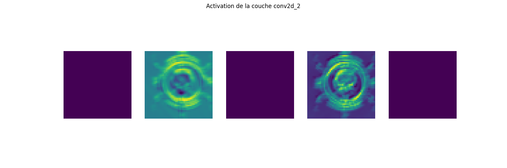

# Valorant Kill Detection using Convolutional Neural Network

This project uses a deep learning model to automatically detect "kill" moments in **Valorant** videos. The model is trained using a labeled dataset of images representing kill and non-kill moments. It uses a Convolutional Neural Network (CNN) to classify the images.

## Features
- **Prediction**: The model can predict whether a given image corresponds to a kill moment or not in a **Valorant** video.
- **Image Preprocessing**: Resizing and padding of images before they are fed into the model.
- **Batch Prediction**: The model can automatically rename all images in a directory based on the predicted class (kill / not kill).

<div align="center">


*Figure showing the activation of the second convolutional layer*

</div>

## Prerequisites

Ensure you have the following libraries installed:
- `tensorflow`: for creating and training the model.
- `keras`: used with TensorFlow to simplify model creation.
- `opencv-python`: for image processing.
- `numpy`: for handling matrices and arrays.
- `matplotlib`: for displaying graphs and images.
- `pathlib`: for file path management.

### Installation
1. Clone the repository:
    ```bash
    git clone https://github.com/yourusername/valorant-kill-detection.git
    cd valorant-kill-detection
    ```

2. Create a virtual environment and install dependencies:
    ```bash
    python -m venv venv
    source venv/bin/activate  # For Linux/MacOS
    venv\\Scripts\\activate     # For Windows
    pip install -r requirements.txt
    ```

3. Make sure you have a `dataset` and `val_data` directory containing labeled images as "kill" and "not_kill".

## Project Structure

- `dataset/`: Contains training images with subfolders `kill` and `not_kill`.
- `val_data/`: Contains validation images to test the model.
- `predict/`: Contains unlabeled images you want to predict and rename.
- `model_final.h5`: The trained model saved after training.
- `train_model.py`: Main script to train the model and perform predictions.

## Model Training

The model is a Convolutional Neural Network (CNN) that follows these steps:

1. **Image Preprocessing**: Resizing to a uniform size and adding padding if necessary.
2. **Model Creation**: The model consists of several convolutional and pooling layers to extract important features from the images.
3. **Compilation and Training**: The model is compiled with the Adam optimizer and the `SparseCategoricalCrossentropy` loss function, then trained for 15 epochs on the training dataset.
4. **Evaluation**: The model is evaluated on the validation dataset to check its performance.

To train the model, simply run:

```bash
python train_model.py